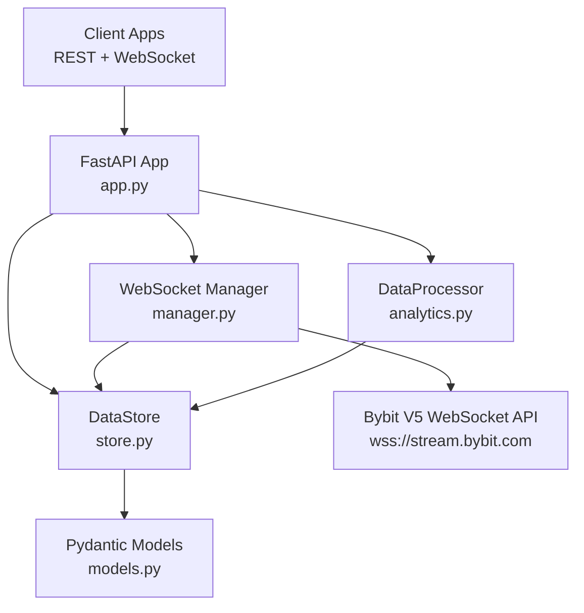

<p align="center">
  <a href="https://github.com/zhulnert-lang/BytSockeTs">
    
  </a>
</p>

<p align="center">
  <a href="https://www.python.org/downloads/"></a>
  <a href="https://fastapi.tiangolo.com"></a>
  <a href="https://docs.pydantic.dev"></a>
  <a href="https://numpy.org"></a>
  <a href="https://github.com/zhulnert-lang/BytSockeTs/blob/master/LICENSE"></a>
</p>

<p align="center">
  <strong>Real-time Bybit V5 market data ingestion and analytics library</strong><br>
  <em>WebSocket streaming, FastAPI REST API, VWAP, spread analysis — production-ready.</em>
</p>

<p align="center">
  <a href="#installation">Installation</a> •
  <a href="#quick-start">Quick Start</a> •
  <a href="#api-reference">API Reference</a> •
  <a href="#architecture">Architecture</a> •
  <a href="#deployment">Deployment</a> •
  <a href="docs/">Documentation</a>
</p>

---

## Features

| Feature | Detail |
|---------|--------|
| **WebSocket Ingestion** | Trades, orderbook (snapshot + delta), 24hr tickers, klines |
| **Auto-Reconnect** | Exponential backoff (5s → 60s cap), heartbeat/ping-pong |
| **Real-Time Analytics** | VWAP, rolling statistics, bid-ask spread analysis |
| **REST API** | 19 endpoints with full OpenAPI/Swagger documentation |
| **WebSocket Streaming** | `/ws/stream` endpoint with per-client symbol filtering |
| **Dynamic Subscriptions** | Add/remove symbols and topics at runtime via REST |
| **Thread-Safe Store** | Bounded in-memory buffers with `asyncio.Lock` |
| **Type Safety** | Full Pydantic v2 models, PEP 561 `py.typed` marker |
| **Error Hierarchy** | Custom exceptions: `BybitConnectionError`, `DataNotFoundError`, `SubscriptionError` |
| **Zero Config** | Works out of the box — configure via dataclass or environment |

## Installation

```bash
# Clone and install (editable)
git clone https://github.com/zhulnert-lang/BytSockeTs.git
cd BytSockeTs
pip install -e .

# Or install dependencies only
pip install -r requirements.txt
```

## Quick Start

### Run the server

```bash
python -m bybit_ws.app
```

| URL | Description |
|-----|-------------|
| http://localhost:8000/docs | Interactive Swagger UI |
| http://localhost:8000/health | Health check |
| http://localhost:8000/analysis/summary | Market summary |
| ws://localhost:8000/ws/stream | Real-time WebSocket stream |

### Use as a library

```python
import asyncio
from bybit_ws import DataStore, DataProcessor, BybitWebSocketManager, MarketType

async def main():
    store = DataStore()
    processor = DataProcessor(store)
    manager = BybitWebSocketManager(store=store, market_type=MarketType.LINEAR)

    await manager.connect()

    # Wait for data, then compute VWAP
    await asyncio.sleep(10)
    vwap = await processor.calculate_vwap("BTCUSDT")
    print(f"VWAP: {vwap}")

asyncio.run(main())
```

### Mount in your own FastAPI app

```python
from fastapi import FastAPI
from bybit_ws.app import app as bybit_app

my_app = FastAPI()
my_app.mount("/market-data", bybit_app)
```

## API Reference

### System

| Method | Endpoint | Description |
|--------|----------|-------------|
| `GET` | `/` | API info and endpoint listing |
| `GET` | `/health` | Connection health check + server time |
| `GET` | `/config` | Current system configuration |
| `GET` | `/status` | Detailed WebSocket connection status |
| `GET` | `/topics` | List subscribed topics |
| `GET` | `/stats` | System-wide statistics |

### Market Data

| Method | Endpoint | Description |
|--------|----------|-------------|
| `GET` | `/symbols` | List all tracked symbols |
| `GET` | `/trades/{symbol}?limit=100` | Recent trades |
| `GET` | `/orderbook/{symbol}?depth=50` | Latest orderbook snapshot |
| `GET` | `/orderbook-deltas/{symbol}?limit=50` | Recent orderbook delta updates |
| `GET` | `/ticker/{symbol}` | Latest 24hr ticker |
| `GET` | `/ticker-history/{symbol}?limit=100` | Historical ticker snapshots |
| `GET` | `/klines/{symbol}?limit=100` | Recent kline/candlestick data |

### Analysis

| Method | Endpoint | Description |
|--------|----------|-------------|
| `GET` | `/analysis/vwap/{symbol}` | Volume-Weighted Average Price |
| `GET` | `/analysis/rolling-stats/{symbol}` | Rolling mean, std, min, max |
| `GET` | `/analysis/spread/{symbol}` | Bid-ask spread (absolute + bps) |
| `GET` | `/analysis/summary/{symbol}` | Full summary for one symbol |
| `GET` | `/analysis/summary` | Summary for all symbols |

### Subscriptions

```bash
# Subscribe to SOLUSDT trades and tickers
curl -X POST http://localhost:8000/subscribe \
  -H "Content-Type: application/json" \
  -d '{"symbols": ["SOLUSDT"], "topics": ["trades", "tickers"]}'

# Unsubscribe
curl -X DELETE http://localhost:8000/subscribe \
  -H "Content-Type: application/json" \
  -d '{"symbols": ["SOLUSDT"], "topics": ["trades"]}'
```

### WebSocket Streaming

```python
import websockets, json

async with websockets.connect("ws://localhost:8000/ws/stream") as ws:
    await ws.send(json.dumps({"action": "subscribe", "symbols": ["BTCUSDT"]}))
    async for message in ws:
        print(json.loads(message))
```

## Architecture

```
BytSockeTs/
├── pyproject.toml              # PEP 621 packaging
├── requirements.txt
├── README.md
└── src/
    └── bybit_ws/
        ├── __init__.py         # 27 public exports
        ├── py.typed            # PEP 561 marker
        ├── app.py              # FastAPI app (19 REST endpoints + WS)
        ├── config.py           # MarketType, AppConfig, WebSocketConfig
        ├── models.py           # Pydantic v2 data models
        ├── store.py            # DataStore (bounded in-memory buffers)
        ├── analytics.py        # DataProcessor (VWAP, rolling, spread)
        ├── manager.py          # BybitWebSocketManager (reconnect, heartbeat)
        └── exceptions.py       # BybitWSError hierarchy
```



## Configuration

```python
from bybit_ws import app_config, ws_config, MarketType

# Market type: SPOT | LINEAR | INVERSE
app_config.MARKET_TYPE = MarketType.LINEAR

# Symbols to track
ws_config.SYMBOLS = ["BTCUSDT", "ETHUSDT", "SOLUSDT"]

# Orderbook depth: 1, 50, or 200
ws_config.ORDERBOOK_DEPTH = 200

# Toggle topics
app_config.SUBSCRIBE_TRADES = True
app_config.SUBSCRIBE_ORDERBOOK = True
app_config.SUBSCRIBE_TICKERS = True
app_config.SUBSCRIBE_KLINES = False

# Analysis windows
app_config.VWAP_WINDOW = 200
app_config.ROLLING_STATS_WINDOW = 500

# Server
app_config.HOST = "0.0.0.0"
app_config.PORT = 8000
app_config.DEBUG = False
```

## Exceptions

```python
from bybit_ws import (
    BybitWSError,           # Base exception
    BybitConnectionError,   # WebSocket connection failures
    DataNotFoundError,      # Missing market data
    SubscriptionError,      # Subscribe/unsubscribe failures
    ConfigurationError,     # Invalid configuration
)

try:
    vwap = await processor.calculate_vwap("BTCUSDT")
except DataNotFoundError:
    print("No trade data available yet")
except BybitWSError as e:
    print(f"bybit-ws error: {e}")
```

## Deployment

### Uvicorn

```bash
uvicorn bybit_ws.app:app --host 0.0.0.0 --port 8000 --workers 1
```

> Use `--workers 1` because the WebSocket manager holds in-memory state. For multi-worker setups, add Redis Pub/Sub as a shared message bus.

### Docker

```dockerfile
FROM python:3.12-slim
WORKDIR /app
COPY . .
RUN pip install --no-cache-dir .
EXPOSE 8000
CMD ["python", "-m", "bybit_ws.app"]
```

```bash
docker build -t bybit-ws .
docker run -p 8000:8000 bybit-ws
```

## Requirements

- Python >= 3.12
- fastapi >= 0.104.0
- uvicorn[standard] >= 0.24.0
- websockets >= 12.0
- pydantic >= 2.5.0
- numpy >= 1.26.0

## License

MIT License — see [LICENSE](LICENSE) for details.

---

<p align="center">
  <sub>Built with <a href="https://fastapi.tiangolo.com">FastAPI</a> + <a href="https://bybit.com">Bybit V5 API</a></sub>
</p>
